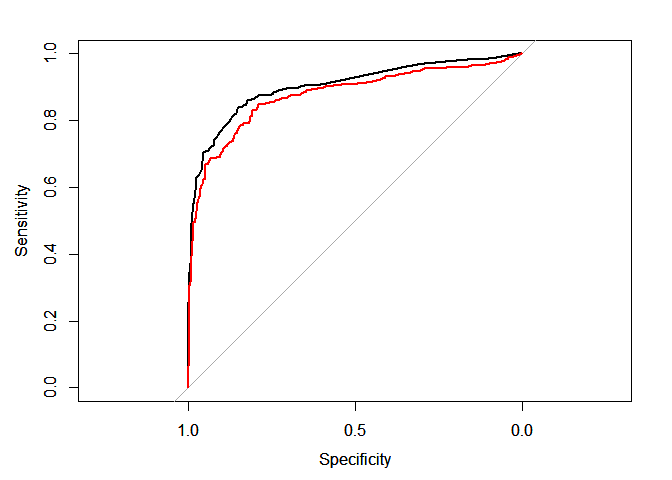

Installation
------------

    devtools::install_git("https://GravesEE@gitlab.ins.risk.regn.net/minneapolis-r-packages/rulefit.git")

Usage
-----

### Training

    # mod <- gbm(Survived~., data=titanic, distribution="bernoulli",
    #   interaction.depth=3, shrinkage=0.1)

    mod <- gbm.fit(titanic[-1], titanic$Survived, distribution="bernoulli",
      interaction.depth=3, shrinkage=0.1, verbose = FALSE)

    rf <- RuleFit(mod, titanic[-1])

    ## Using OOB method...

    print(rf)

    ## RuleFit model

### Predicting

    p_min <- predict(rf, titanic[-1], s="lambda.min")
    p_1se <- predict(rf, titanic[-1], s="lambda.1se")

    roc_min <- pROC::roc(titanic$Survived, -p_min)
    roc_1se <- pROC::roc(titanic$Survived, -p_1se)

    plot(roc_min)
    par(new=TRUE)
    plot(roc_1se, col="red")

### Predicting on New Data

    v <- rf$gbm_model$var.names
    p_sample <- predict(rf, newdata=head(titanic)[v], s="lambda.min")
    p_sample

    ## [1] -1.9806684  3.6870663 -0.3655427  2.9242300 -1.9806684 -2.2685021

### Keeping K-Fold Predictions

    rf2 <- RuleFit(mod, titanic[-1], keep=TRUE)

    ## Using OOB method...

    dev <- predict(rf2, titanic[-1], s="lambda.min")
    val <- rf2$glmnet_mod$fit.preval[, which.min(rf2$glmnet_mod$cvm)]

    roc_dev <- pROC::roc(titanic$Survived, -dev)
    roc_val <- pROC::roc(titanic$Survived, -val)

    plot(roc_dev)
    par(new=TRUE)
    plot(roc_val, col="red")

### Exporting SAS Code

    code <- rulefit_to_sas(rf, pfx="mod1")
    writeLines(code, "rule_fit_model.sas")

Code sample of first and last 6 lines:

    ## /*** Rule Definitions ***/
    ## 
    ## mod1_rule_001  =  (Sex in ("female")) and (Pclass in ("1","2")) ;
    ## mod1_rule_002  =  (Sex in ("male")) and (.z < Fare < 26.26875) ;
    ## mod1_rule_003  =  (Sex in ("female")) and (Pclass in ("1","2")) ;
    ## mod1_rule_004  =  (Sex in ("male")) and (.z < Fare < 26.26875) ;
    ## 
    ## ...
    ## 
    ##   mod1_rule_020 *  0.0051213478 +
    ##   mod1_rule_021 *  0.2667739166 +
    ##   mod1_rule_022 *  1.3841167256 +
    ##   mod1_rule_023 *  0.0314834432 +
    ##   mod1_rule_024 *  0.5259447413
    ## ;
