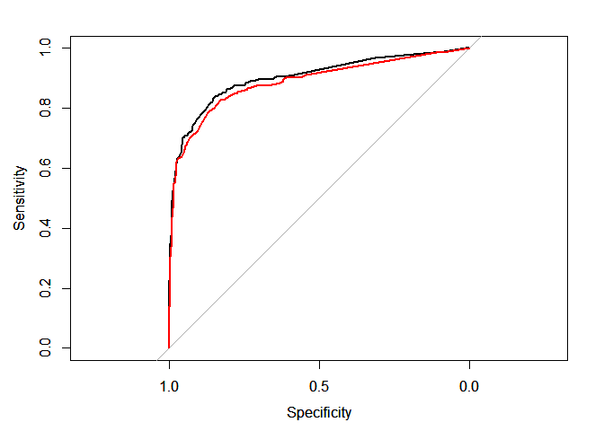

Installation
------------

    devtools::install_git("https://GravesEE@gitlab.ins.risk.regn.net/minneapolis-r-packages/rulefit.git")

Usage
-----

### Creating a RuleFit Model

A RuleFit model uses a tree ensemble to generate its rules. As such, a
tree ensemble model must be provided to the rulefit function. This
funciton returns a RuleFit object which can be used to mine rules and
train rule ensembles.

    mod <- gbm.fit(titanic[-1], titanic$Survived, distribution="bernoulli",
      interaction.depth=3, shrinkage=0.1, verbose = FALSE)

    rf <- rulefit(mod, n.trees=100)

    print(rf)

    ## RuleFit object with 1000 rules
    ## Rules generated from gbm model show below
    ## --------------------------------------------------------------------------------
    ## A gradient boosted model with bernoulli loss function.
    ## 100 iterations were performed.
    ## There were 7 predictors of which 7 had non-zero influence.

the `rulefit` function wraps a gbm model in a class that manages rule
construction and model fitting. The rules are generated immediately but
the model is not fit until the `train` function is called.

    head(lapply(rf$rules, toString))

    ## [[1]]
    ## [1] ""
    ## 
    ## [[2]]
    ## [1] "Sex IN [\"male\"]"
    ## 
    ## [[3]]
    ## [1] "Sex IN [\"female\"]"
    ## 
    ## [[4]]
    ## [1] "Pclass IN [\"3\"] AND Sex IN [\"female\"]"
    ## 
    ## [[5]]
    ## [1] "Fare < 23.35000 AND Pclass IN [\"3\"] AND Sex IN [\"female\"]"
    ## 
    ## [[6]]
    ## [1] "Fare >= 23.35000 AND Pclass IN [\"3\"] AND Sex IN [\"female\"]"

For ease of programming *every* internal node is generated -- even the
root node. That is why the first rule listed above is empty. Root nodes
are not splits. This was a design decision and does not affect how the
package is used in practice.

### Training

Training a RuleFit model is as easy as calling the train method. The
train method uses the `cv.glmnet` function from the `glmnet` package and
accepts all of the same arguments.

##### Common Arguments

<table style="width:11%;">
<colgroup>
<col width="5%" />
<col width="5%" />
</colgroup>
<thead>
<tr class="header">
<th align="left">Argument</th>
<th align="left">Purpose</th>
</tr>
</thead>
<tbody>
<tr class="odd">
<td align="left">x</td>
<td align="left">Dataset of predictors that should match what was used for training the ensemble.</td>
</tr>
<tr class="even">
<td align="left">y</td>
<td align="left">Target variable to train against.</td>
</tr>
<tr class="odd">
<td align="left">family</td>
<td align="left">What is the distribution of the target? Binomial for 0/1 variables.</td>
</tr>
<tr class="even">
<td align="left">keep</td>
<td align="left">TRUE/FALSE for whether to keep the out-of-fold predictions. Useful for validation.</td>
</tr>
<tr class="odd">
<td align="left">alpha</td>
<td align="left">Penatly mixing parameter. LASSO regression uses the default of 0.</td>
</tr>
<tr class="even">
<td align="left">nfolds</td>
<td align="left">How many k-folds to train the model with. Defaults to 5.</td>
</tr>
<tr class="odd">
<td align="left">dfmax</td>
<td align="left">How many variables should the final model have?</td>
</tr>
<tr class="even">
<td align="left">parallel</td>
<td align="left">TRUE/FALSE to build kfold models in parallel. Require a backend.</td>
</tr>
</tbody>
</table>

    rf <- train(rf, titanic[-1], y = titanic$Survived, family="binomial", keep=T)

### Predicting

Once a RuleFit model is trained. Predictions can be produced by calling
the predict method. As with the train function, `predict` also takes
arguments accepted by `predict.cv.glmnet`. The most important of which
is the lambda parameter, `s`. The default is to use `s="lambda.min"`
which minimizes the out-of-fold error.

Both a score as well as a sparse matrix of rules can be predicted.

    p_rf <- predict(rf, newx = titanic[-1], s="lambda.1se")
    nodes <- predict(rf, newx = titanic[-1], s="lambda.1se", nodes=TRUE)

    head(p_rf)

    ##               1
    ## [1,] -1.8794196
    ## [2,]  2.3696817
    ## [3,]  0.2074039
    ## [4,]  3.3687977
    ## [5,] -1.7455661
    ## [6,] -1.8397563

    head(nodes)

    ## 6 x 42 sparse Matrix of class "ngCMatrix"
    ##                                                                           
    ## [1,] . . . . . | . . | . . . . . | . . . . . . . | . . | . . . . . . . . .
    ## [2,] . | . | | . | | . | | | | . . | | . | . | . . | . . . | . . . . . . .
    ## [3,] . . . . . . . . . | . . | . . | . . | . . . . . . . . . . . . . . | .
    ## [4,] . | . | | . | | . | | | | . . | | . | . | . . | . . . . . . . | . . .
    ## [5,] . . . . . | . . | . . . . . | . . . . . . . | . . | . . . . . . . . .
    ## [6,] . . . . . | . . | . . . . . | . . . . . . . | . | | . . . . . . . . .
    ##                   
    ## [1,] . . . . . . .
    ## [2,] | . . . . . .
    ## [3,] . . . . | . .
    ## [4,] | | . . . . .
    ## [5,] . | . . . . .
    ## [6,] . . . . . . .

The out-of-fold predictions can also be extracted if the model was
trained with `keep=TRUE`. Again, this is working with the `cv.glmnet`
API. There is nothing magical going on here:

    p_val <- rf$fit$fit.preval[,match(rf$fit$lambda.1se, rf$fit$lambda)]

#### Comparing RuleFit dev & val to GBM

    p_gbm <- predict(mod, titanic[-1], n.trees = gbm.perf(mod, plot.it = F))

    ## Using OOB method...

    roc_rf <- pROC::roc(titanic$Survived, -p_rf)
    roc_val <- pROC::roc(titanic$Survived, -p_val)
    roc_gbm <- pROC::roc(titanic$Survived, -p_gbm)

    plot(roc_rf)
    par(new=TRUE)
    plot(roc_val, col="blue")
    par(new=TRUE)
    plot(roc_gbm, col="red")

### Rule Summary

RuleFit also provides a summary method to inspect and measure the
coverage of fitted rules.

    s <- summary(rf, s="lambda.1se", dedup=TRUE)
    s

    ##                                                               rule
    ## 1                              Fare < 52.27710 AND Sex IN ["male"]
    ## 2                        Sex IN ["male"] AND Embarked IN ["Q","S"]
    ## 3                          Pclass IN ["2","3"] AND Sex IN ["male"]
    ## 4                              Fare < 26.26875 AND Sex IN ["male"]
    ## 5                            SibSp < 2.50000 AND Sex IN ["female"]
    ## 6                            Parch < 1.50000 AND Sex IN ["female"]
    ## 7    Pclass IN ["1","2"] AND Fare >= 7.88750 AND Sex IN ["female"]
    ## 8                        Pclass IN ["1","2"] AND Sex IN ["female"]
    ## 9           Pclass IN ["1"] AND Age < 53.50000 AND Fare >= 7.63960
    ## 10    Pclass IN ["1"] AND Embarked IN ["C","S"] AND Age < 49.50000
    ## 11                             Fare < 29.85000 AND Age >= 36.25000
    ## 12    Age >= 30.75000 AND Embarked IN ["C","S"] AND Age < 36.25000
    ## 13     Fare >= 14.85205 AND Fare < 107.66250 AND Embarked IN ["C"]
    ## 14             Fare >= 8.08125 AND Age IS NULL AND SibSp < 2.50000
    ## 15                              Age >= 27.50000 AND Fare < 7.91040
    ## 16 Embarked IN ["C","Q"] AND Pclass IN ["3"] AND Sex IN ["female"]
    ## 17                            Fare < 7.88750 AND Sex IN ["female"]
    ## 18                            Sex IN ["female"] AND Fare < 7.88335
    ## 19           Age < 20.50000 AND Fare < 8.12500 AND Fare >= 7.13335
    ## 20       Age < 8.50000 AND SibSp < 2.50000 AND Pclass IN ["2","3"]
    ## 21      Fare >= 23.35000 AND Pclass IN ["3"] AND Sex IN ["female"]
    ## 22         Embarked IN ["Q"] AND Age IS NULL AND Sex IN ["female"]
    ## 23                            Fare < 57.48960 AND Fare >= 52.27710
    ## 24                            Fare < 14.75000 AND Fare >= 13.93125
    ## 25          Sex IN ["male"] AND Age < 13.00000 AND SibSp < 2.50000
    ## 26                              Fare < 8.03960 AND Fare >= 7.91040
    ## 27                              Fare >= 7.91040 AND Fare < 8.03960
    ## 28                              Age < 27.50000 AND Age >= 26.50000
    ## 29           Age < 27.50000 AND Age >= 26.50000 AND Age < 51.50000
    ## 30         Fare >= 26.26875 AND Fare < 26.77500 AND Age >= 2.50000
    ## 31                            Fare < 30.59790 AND Fare >= 29.85000
    ##       support   coefficient                          number
    ## 1  0.57351291 -0.1330504476                              73
    ## 2  0.54096521 -0.2986900722                             363
    ## 3  0.51066218 -0.4455881554                         43, 153
    ## 4  0.46576880 -0.1025450102                             453
    ## 5  0.32884400  0.5402378620                    87, 127, 177
    ## 6  0.28507295  0.2262245400                             257
    ## 7  0.19079686  0.0093348445                             277
    ## 8  0.19079686  2.0023242406 8, 18, 28, 58, 68, 98, 118, 428
    ## 9  0.16947250  0.3997983657                             216
    ## 10 0.15712682  0.0490924074                             646
    ## 11 0.12906846 -0.1677432681                             247
    ## 12 0.11672278  0.1338535417                             696
    ## 13 0.09876543  0.0422153156                             476
    ## 14 0.08080808  0.0396633108                             437
    ## 15 0.06621773 -0.1128672140                             594
    ## 16 0.06285073  0.1605616556                              16
    ## 17 0.04713805  0.1423028462                             274
    ## 18 0.04713805  0.0654716288                             734
    ## 19 0.03815937  0.0656134494                             465
    ## 20 0.03703704  1.2282777346                             144
    ## 21 0.03030303 -0.4832416940                               6
    ## 22 0.02693603  0.5142053449                        358, 868
    ## 23 0.02693603  0.9074777759                             587
    ## 24 0.02356902 -0.2502898180                             777
    ## 25 0.02356902  2.1536572416                             635
    ## 26 0.02132435  0.3400778927                             597
    ## 27 0.02132435  0.0004094921                             804
    ## 28 0.02020202  0.2508015361                             484
    ## 29 0.02020202  0.0004222513                             495
    ## 30 0.02020202  0.7520454260                             996
    ## 31 0.01459035  0.7164780846                             567
