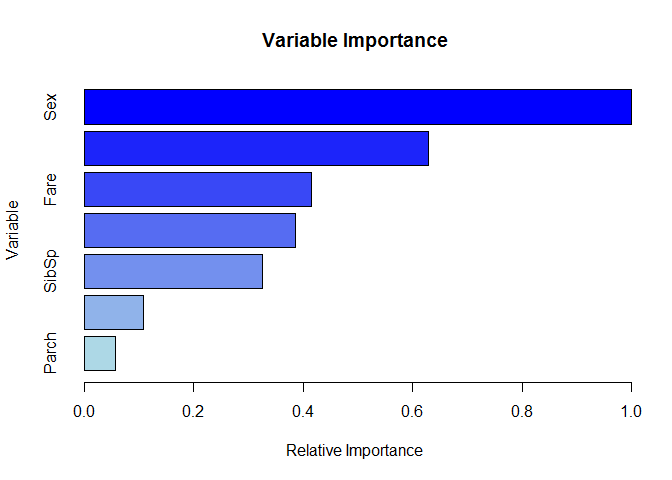

Installation
------------

    devtools::install_git("https://GravesEE@gitlab.ins.risk.regn.net/minneapolis-r-packages/rulefit.git")

Usage
-----

### Creating a RuleFit Model

A RuleFit model uses a tree ensemble to generate its rules. As such, a
tree ensemble model must be provided to the rulefit function. This
funciton returns a RuleFit object which can be used to mine rules and
train rule ensembles.

    mod <- gbm.fit(titanic[-1], titanic$Survived, distribution="bernoulli",
      interaction.depth=3, shrinkage=0.1, verbose = FALSE)

    rf <- rulefit(mod, n.trees=100)

    print(rf)

    ## RuleFit object with 1000 rules
    ## Rules generated from gbm model show below
    ## --------------------------------------------------------------------------------
    ## A gradient boosted model with bernoulli loss function.
    ## 100 iterations were performed.
    ## There were 7 predictors of which 7 had non-zero influence.

the `rulefit` function wraps a gbm model in a class that manages rule
construction and model fitting. The rules are generated immediately but
the model is not fit until the `train` function is called.

    head(rf$rules)

    ## [[1]]
    ## NULL
    ## 
    ## [[2]]
    ## [1] "Sex IN [\"male\"]"
    ## 
    ## [[3]]
    ## [1] "Age < 6.50000 AND Sex IN [\"male\"]"
    ## 
    ## [[4]]
    ## [1] "Age >= 6.50000 AND Sex IN [\"male\"]"
    ## 
    ## [[5]]
    ## [1] "Age IS NULL AND Sex IN [\"male\"]"
    ## 
    ## [[6]]
    ## [1] "Sex IN [\"female\"]"

For ease of programming *every* internal node is generated -- even the
root node. That is why the first rule listed above is empty. Root nodes
are not splits. This was a design decision and does not affect how the
package is used in practice.

### Training

Training a RuleFit model is as easy as calling the train method. The
train method uses the `cv.glmnet` function from the `glmnet` package and
accepts all of the same arguments.

##### Common Arguments

<table style="width:11%;">
<colgroup>
<col width="5%" />
<col width="5%" />
</colgroup>
<thead>
<tr class="header">
<th align="left">Argument</th>
<th align="left">Purpose</th>
</tr>
</thead>
<tbody>
<tr class="odd">
<td align="left">x</td>
<td align="left">Dataset of predictors that should match what was used for training the ensemble.</td>
</tr>
<tr class="even">
<td align="left">y</td>
<td align="left">Target variable to train against.</td>
</tr>
<tr class="odd">
<td align="left">family</td>
<td align="left">What is the distribution of the target? Binomial for 0/1 variables.</td>
</tr>
<tr class="even">
<td align="left">alpha</td>
<td align="left">Penatly mixing parameter. LASSO regression uses the default of 0.</td>
</tr>
<tr class="odd">
<td align="left">nfolds</td>
<td align="left">How many k-folds to train the model with. Defaults to 5.</td>
</tr>
<tr class="even">
<td align="left">dfmax</td>
<td align="left">How many variables should the final model have?</td>
</tr>
<tr class="odd">
<td align="left">parallel</td>
<td align="left">TRUE/FALSE to build kfold models in parallel. Requires a backend.</td>
</tr>
</tbody>
</table>

    fit <- train(rf, titanic[-1], y = titanic$Survived, family="binomial")

### Bagging

Training the model on repeated, random samples with replacement can
generate better parameter estimates. This is known as bagging.

    library(doSNOW)

    ## Loading required package: iterators

    ## Loading required package: snow

    ## 
    ## Attaching package: 'snow'

    ## The following objects are masked from 'package:parallel':
    ## 
    ##     clusterApply, clusterApplyLB, clusterCall, clusterEvalQ,
    ##     clusterExport, clusterMap, clusterSplit, makeCluster,
    ##     parApply, parCapply, parLapply, parRapply, parSapply,
    ##     splitIndices, stopCluster

    cl <- makeCluster(3)
    registerDoSNOW(cl)

    fit <- train(rf, titanic[-1], y = titanic$Survived, bag = 20, parallel = TRUE, 
      family="binomial")

    stopCluster(cl)

### Predicting

Once a RuleFit model is trained. Predictions can be produced by calling
the predict method. As with the train function, `predict` also takes
arguments accepted by `predict.cv.glmnet`. The most important of which
is the lambda parameter, `s`. The default is to use `s="lambda.min"`
which minimizes the out-of-fold error.

Both a score as well as a sparse matrix of rules can be predicted.

    p_rf <- predict(fit, newx = titanic[-1], s="lambda.1se")

    head(p_rf)

    ##              1
    ## [1,] -2.123572
    ## [2,]  2.527064
    ## [3,]  1.058210
    ## [4,]  3.266335
    ## [5,] -1.662469
    ## [6,] -1.842078

The out-of-fold predictions can also be extracted if the model was
trained with `keep=TRUE`. Again, this is working with the `cv.glmnet`
API. There is nothing magical going on here:

    p_val <- fit$fit$fit.preval[,match(fit$fit$lambda.1se, fit$fit$lambda)]

#### Comparing RuleFit dev & val to GBM

    p_gbm <- predict(mod, titanic[-1], n.trees = gbm.perf(mod, plot.it = F))

    ## Using OOB method...

    roc_rf <- pROC::roc(titanic$Survived, -p_rf)
    roc_val <- pROC::roc(titanic$Survived, -p_val)
    roc_gbm <- pROC::roc(titanic$Survived, -p_gbm)

    plot(roc_rf)
    par(new=TRUE)
    plot(roc_val, col="blue")
    par(new=TRUE)
    plot(roc_gbm, col="red")

### Rule Summary

RuleFit also provides a summary method to inspect and measure the
coverage of fitted rules.

    fit_summary <- summary(fit, s="lambda.1se", dedup=TRUE)
    head(fit_summary)

    ##                                                           rule    support
    ## 1                    Pclass IN ["1","2"] AND Sex IN ["female"] 0.19079686
    ## 2                        SibSp < 2.50000 AND Sex IN ["female"] 0.32884400
    ## 3                      Pclass IN ["2","3"] AND Sex IN ["male"] 0.51066218
    ## 4                          Fare < 26.26875 AND Sex IN ["male"] 0.46576880
    ## 5 Fare >= 26.26875 AND Fare < 27.13540 AND Pclass IN ["1","2"] 0.02469136
    ## 6                         Fare >= 52.27710 AND Fare < 60.28750 0.03030303
    ##   coefficient node importance
    ## 1   2.1090142 1208  0.8286934
    ## 2   0.5712488   77  0.2683688
    ## 3  -0.4158792  452  0.2078923
    ## 4  -0.2736690   43  0.1365134
    ## 5   0.7941258  896  0.1232346
    ## 6   0.6012536  804  0.1030668

### Variable Importance

Like other tree ensemble techniques, variable importance can be
calculated. This is different than the **rule** importance. Variable
importance corresponds to the input variables used to generate the
rules.

    imp <- importance(fit, titanic[-1], s="lambda.1se")
    plot(imp)

